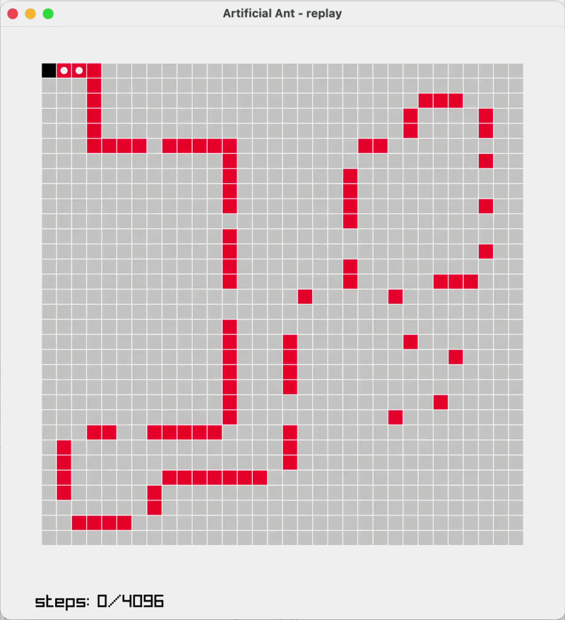

## Artificial Ant Programmed via Genetic Programming
Harness for performing various experiments using genetic programming on an artificial ant.  
For a certain experiment, ant is usually trained on multiple maps at once, across multiple train runs.

  
*visualization of an ant trained on only the Santa Fe map*

### Run
Package manager uv for python is reguired.

1. run `uv sync` in the /src/ directory to download libraries
2. run `uv run training.py` to train

### Evaluate
1. run `uv run test.py` with visualization enabled
2. press spacebar to start the visualization

### Extras
- map_editor.py - allows user to draw a map
